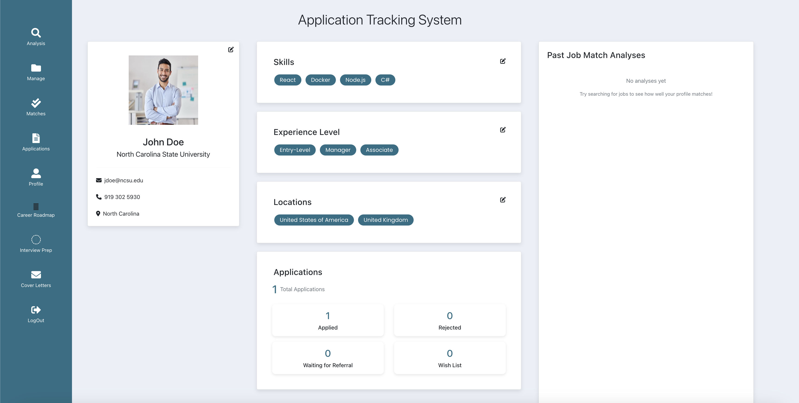
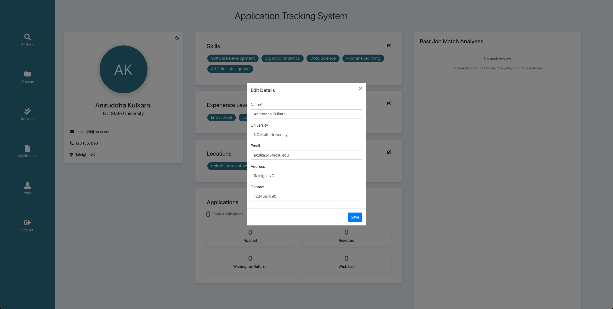
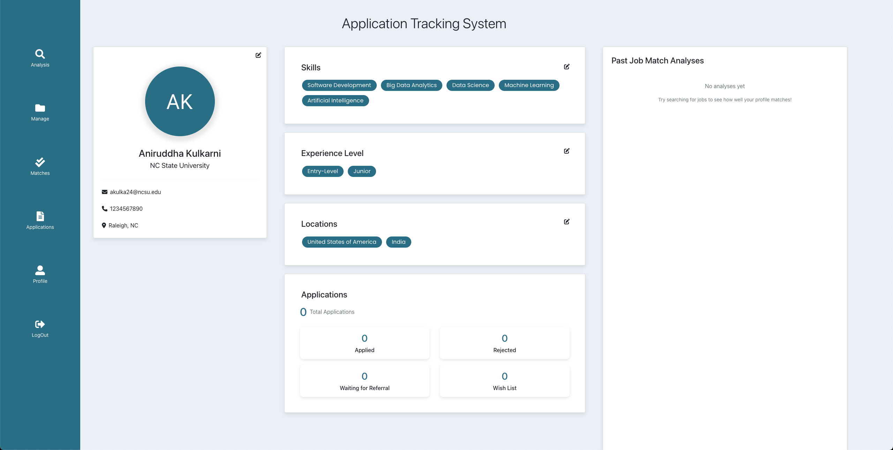
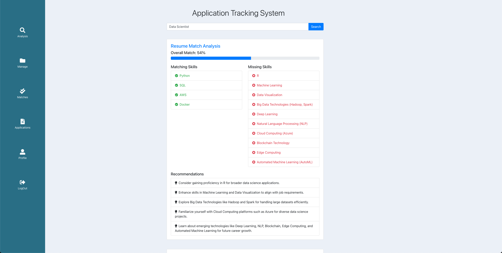
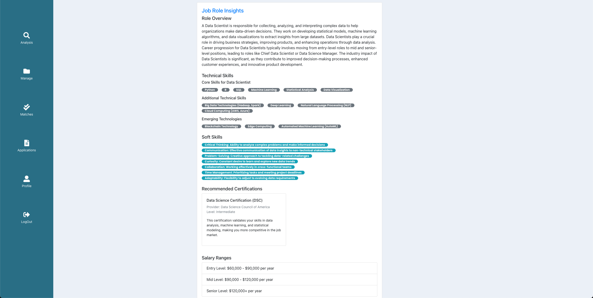
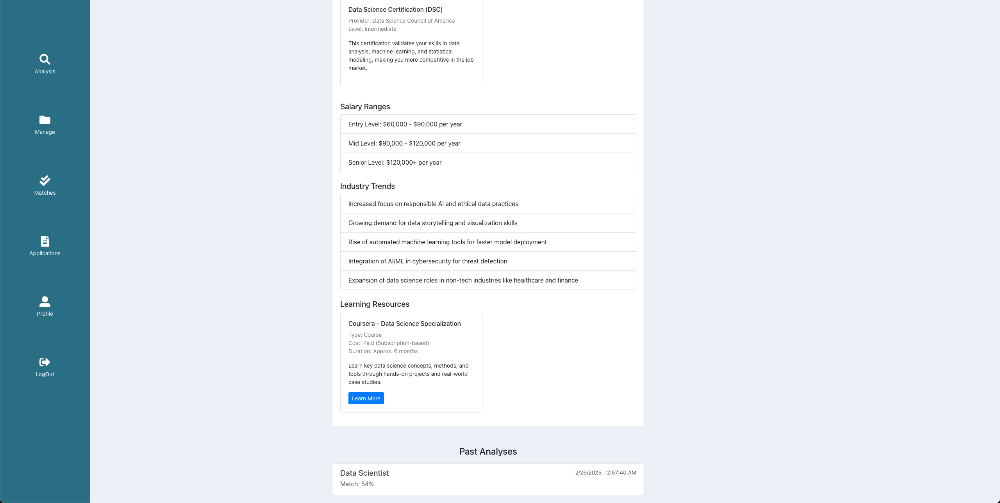
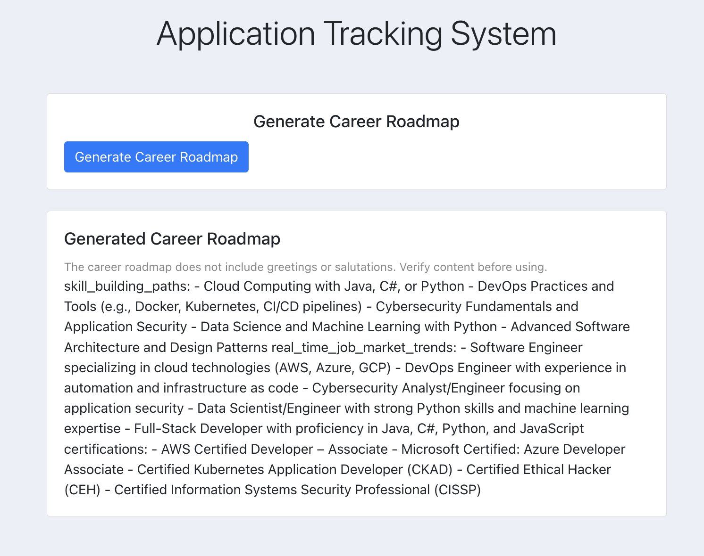
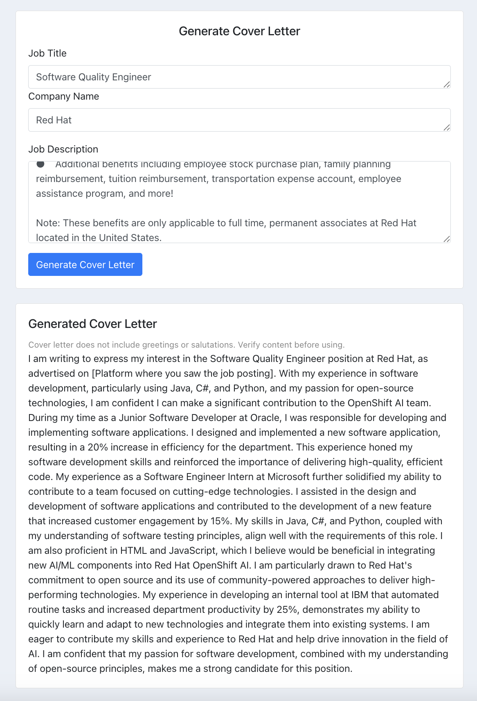
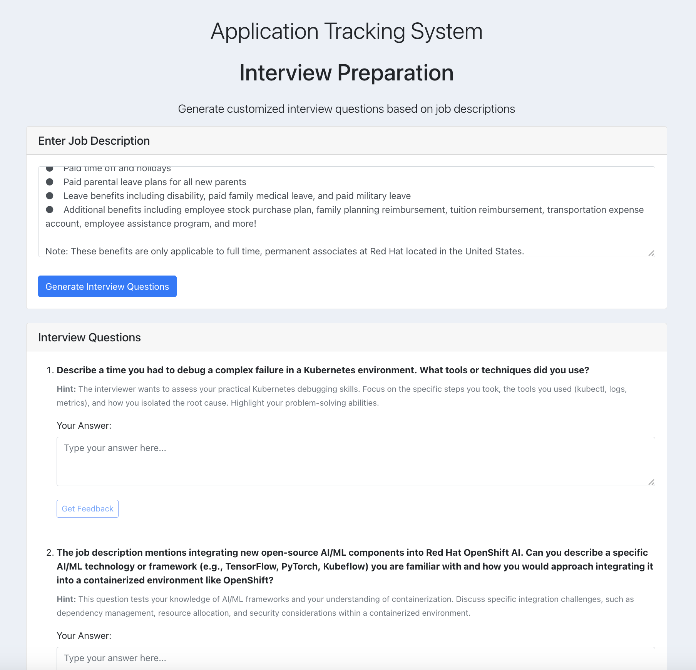
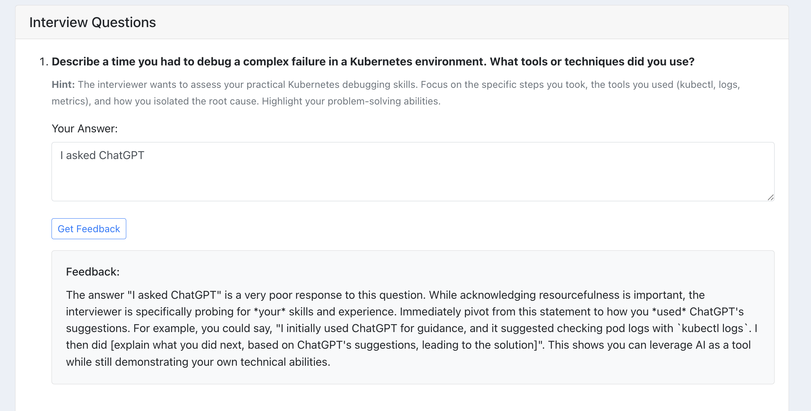

# J-Tracker - Your Job Tracking Assistant

[](https://img.shields.io/badge/python-3670A0?style=for-the-badge&logo=python&logoColor=ffdd54)
[](https://github.com/Group21-SWE/Project2/blob/main/LICENSE)
[](https://doi.org/10.5281/zenodo.15211854)
[](https://codecov.io/gh/Group21-SWE/Project2)
[](https://github.com/Group21-SWE/Project2/issues)
[](https://github.com/Group21-SWE/Project2/issues?q=is%3Aissue%20state%3Aclosed)

[](https://github.com/Group21-SWE/Project2/releases)
[](https://github.com/Group21-SWE/Project2/forks)
[](https://github.com/Group21-SWE/Project2/graphs/commit-activity)
[](https://github.com/Group21-SWE/Project2/graphs/contributors)

The internship application and job application process is no picnic. Job application management is time-consuming. With the referrals and deadlines, the whole process can get daunting. Our app enables you to track and organize your job application process, and manage it, without the inconvenience of clunky Excel spreadsheets.

Our software maintains a record of the work you have wish-listed. It records those companies that you have applied for and records any rejections. Instead of making the user visit each company's website for prospects, our software enables the applicant to look for them directly using simple keywords. Any possible offer of work may then be wish-listed by the applicant.

## New Features in Project 3

🎥 [Project 3 Demo Video](https://www.youtube.com/watch?v=23MS7p4_GZE) 

## ⭐ Highlight of Project 3 ⭐
### ⭐ More AI Features and Updates!
1. Generate cover letters using AI
2. Create practice interview questions and get feedback on answers
3. Create a personalized career roadmap based on your skills
4. Add a profile picture to your profile!

#### Bug fixes
1. Sped up build time of backend from 1000s to 10-20s

<!-- 
## ⭐ Highlight of Project2 ⭐
### Dockerization 🗃️
Containerizing the application with docker has helped us achieve 2 significant things
1. Dramatically boosting the speed at which one would be able to configure the project in their machines.
2. Automation of the entire run of the application including running the tests!

### ⭐ New AI Features and Updates!
1. Improved scalability and maintainability with optimized querying and restructured user entity fields.
2. AI-driven job matching system leveraging user profiles and resumes for better recommendations.
3. Enhanced profile updates and better resume parsing for accurate job-fit analysis.
4. AI integration for personalized career path suggestions and top opportunity highlights.

#### Bug fixes
1. OAuth Restoration
2. Docker Restoration Repair
3. Authentication into the application randomly not working.
3. Resolved profile update errors and improved system stability and efficiency -->


---
## Table of contents

- [Basic Design](#basic-design)
- [Samples](#samples)
- [New Features In Phase 3](#new-features-in-phase-3)
- [Future Scope](#future-scope)
- [Explanation](#explanation)
- [Technologies Used](#technologies-used)
- [Hosting the Database](#hosting-the-database)
  - [Local MongoDB](#local-mongodb)
  - [Hosted database with MongoDB Atlas](#hosted-database-with-mongodb-atlas)
- [License](#license)
- [How to Contribute](#how-to-contribute)
- [Team Members](#team-members)

## Basic Design:


## Samples:

### Login Page / Signup Page

The introductory visual interface displayed from which a user is able to register and log into the application. User can also login or sign up through Google Authorization.

<p align="center"></p>
The Google Authorization Login:

<p align="center"></p>

### HomeScreen - Profile Page

After Logging In, the Profile page of the user is displayed where the user details such as Name, Institution, email, phone number, address, skills, and more are shown.
Users can add or update information to their profile, such as their personal information, skills, preferred job locations, and their experience level.

<p align="center"></p>

### JobSearchPage 

1. A past analyses column has been added to the dashboard. Here the users will get a summarized version of the comparison between their resume and the job they would like to apply to. 

2. Another feature has been added for ease of use by mentioning a summary of the applications made by each user. The dashboard now shows a count of all the applications as well as the category- Applied, Rejected, Wish List and Waiting for Referral.

3. In the earlier versions of the software the skills were not saved for when the user logs in again. We have solved this bug. Now the users can see their previous preferences after logging in again. They can then update these without any hassle. We have made sure that our database and our code takes care of managing this

4. We have incorporated an AI model to recommend jobs to the user. Instead of just fetching jobs from google, our code will now based off the preferences of the user, their skills, their experience will curate job opportunities for the user. In this way, the user is only recommended jobs that fit their application requirements and they don’t have to waste time reading the job description thoroughly

<p align="center"></p> 
<p align="center"></p>
<p align="center"></p>
<p align="center"></p>
<p align="center"></p>


### ApplicationPage

The user is able to see different saved applications - Waitlisted applications, Waiting for Refereals, Applied Jobs, Application Status. The user is also able to add more jobs to track using this screen.

<p align="center"></p>

### MatchesPage

Here, user is able to see different jobs which would be recommended to them according to their profile and also their interest. User can apply for that job from this page as well.

<p align="center"></p>

### Create a personalized career roadmap

Using the user's resume and skills, create a roadmap with skill building paths, real time job market trends and certifications.

<p align="center"></p>

### Generate Cover Letters

The user can input the job title and job description and get a professional cover letter.

<p align="center"></p>

### Practice Interview Questions

The user can enter the job description and get questions that might be asked in an interview. Then, the user can respond and get feedback on their answers.

<p align="center"></p>

<p align="center">

## Future Scope:

- Resume Feedback: Get feedback on your resume from AI both in general, and then ask to tailor it to a specific job description.
- Covert from OpenAI ChatGPT to Google Gemini: ChatGPT requires payment for tokens, so switching to Gemini, which has a free plan, makes the project more accessible.
- Add certifications and accomplishment sections on profile: Add a new section to allow for certifications, accomplishments, published papers, etc.
- Autofill Job Information: Autofill information about jobs when putting them into the applications page by using the link to the job.
- Curriculum Vitae Generator: Convert your accomplishments, past jobs, published papers, etc into a CV.

## Technologies Used:

- Python
- Node.Js
- Flask
- MongoDB
- React
- Docker

## Hosting the Database:

### Local MongoDB:

1. Download [MongoDB Community Server](https://docs.mongodb.com/manual/administration/install-community/)
    - Recommended Homebrew installation
2. Follow the [Installion Guide](https://docs.mongodb.com/guides/server/install/)
3. In app.py set 'host' string to 'localhost'
    ```
    app.config["MONGODB_SETTINGS"] = {
        "db": "appTracker",
        "host": 'localhost',
    }
    ```
4. Run the local database:

mongodb

- Recommended: Use a GUI such as [Studio 3T](https://studio3t.com/download/) to more easily interact with the database

### Hosted database with MongoDB Atlas: 

1. [Create account](https://account.mongodb.com/account/register) for MongoDB

    - **If current MongoDB Atlas owner adds your username/password to the cluster, skip to step 4** \*

2. Follow MongoDB Atlas [Setup Guide](https://docs.atlas.mongodb.com/getting-started/) to create a database collection for hosting applications
3. Create application.yml in the backend folder with the following contents:
   ```
   GOOGLE_CLIENT_ID : <Oauth Google ID>
   GOOGLE_CLIENT_SECRET : <Oauth Google Secret>
   CONF_URL : https://accounts.google.com/.well-known/openid-configuration
   SECRET_KEY : <Any Secret You Want>
   USERNAME : <MongoDB Atlas Username>
   PASSWORD : <MongoDB Atlas Password>
   CLUSTER_URL : <MongoDB Cluster URL>
   ```
    <details>
    <summary>Claude 3.7 Sonnet Assistance: How to obtain application.yml fields</summary>
    <br>
    <h3>Obtaining Values for application.yml Fields</h3>
    <p>Here's how to obtain each field required in your application.yml file:</p>

    <h4>SECRET_KEY</h4>
    <ul>
    <li>Generate a secure random string (can be any string of your choice)</li>
    <li>You can use Python to generate one: <code>python -c "import secrets; print(secrets.token_hex(16))"</code></li>
    </ul>

    <h4>CONNECTION_STRING</h4>
    <ul>
    <li>This appears to be set by default to "cluster0.jmi6a.mongodb.net"</li>
    <li>If using a different MongoDB Atlas cluster, you'll find this in your connection string</li>
    </ul>

    <h4>GOOGLE_CLIENT_ID and GOOGLE_CLIENT_SECRET</h4>
    <ol>
    <li>Go to the <a href="https://console.cloud.google.com/">Google Cloud Console</a></li>
    <li>Create a new project (or select an existing one)</li>
    <li>Navigate to "APIs & Services" > "Credentials"</li>
    <li>Click "Create Credentials" > "OAuth client ID"</li>
    <li>Configure the OAuth consent screen</li>
    <li>Select "Web application" as the application type</li>
    <li>Add authorized redirect URIs (e.g., http://localhost:3000/oauth/callback)</li>
    <li>Click "Create"</li>
    <li>You'll receive your Client ID and Client Secret</li>
    </ol>

    <h4>CONF_URL</h4>
    <ul>
    <li>This is already correctly set to the standard Google OpenID configuration URL</li>
    </ul>

    <h4>MongoDB Atlas Credentials (USERNAME, PASSWORD, CLUSTER_URL)</h4>
    <ol>
    <li>Sign up or log in to <a href="https://www.mongodb.com/cloud/atlas">MongoDB Atlas</a></li>
    <li>Create a new cluster or use an existing one</li>
    <li>Click "Connect" on your cluster</li>
    <li>Choose "Connect your application"</li>
    <li>The connection string will look like: <code>mongodb+srv://&lt;username&gt;:&lt;password&gt;@&lt;cluster-url&gt;/test?retryWrites=true&w=majority</code></li>
    <li>From this string:
        <ul>
        <li>USERNAME is your MongoDB Atlas user</li>
        <li>PASSWORD is your MongoDB Atlas user password</li>
        <li>CLUSTER_URL is the domain after the @ symbol (before the slash)</li>
        </ul>
    </li>
    </ol>

    <p><strong>Note:</strong> For local development with MongoDB running on your machine, you can set:</p>
    <ul>
    <li>USERNAME and PASSWORD to your local MongoDB credentials</li>
    <li>CLUSTER_URL can be empty or "localhost"</li>
    </ul>
    <br>
    </details>

    **Note that application.yml should remain private on your local machine.**
4. In app.py set 'host' string to your MongoDB Atlas connection string. Replace the username and password with {username} and {password} respectively
6. For testing through CI to function as expected, repository secrets will need to be added through the settings. Create individual secrets with the following keys/values:

    MONGO_USER: <MongoDB Atlas cluster username>
    MONGO_PASS: <MongoDB Atlas cluster password>

## License

The project is licensed under the [MIT](https://choosealicense.com/licenses/mit/) license.

## How to Contribute?

Please see our CONTRIBUTING.md for instructions on how to contribute to the repository and assist us in improving the project.

## Team Members

- Abhinav Sharma
- Haven Brown
- Trent Wiens
